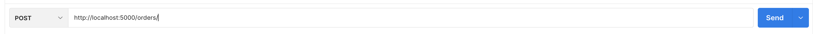
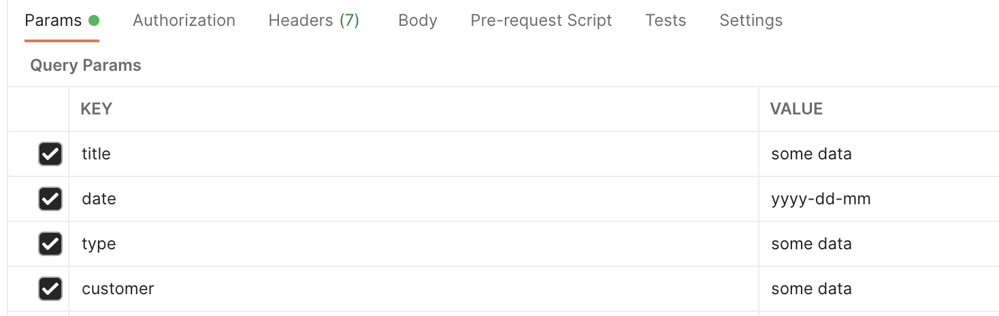

# TELERESULT API BUILDING CHALLENGE

## Submitted to TeleResult by Graeme Chalmers ([Github](https://github.com/g-ram84))

#### Built With

This API was built with the following technologies:

- JavaScript
- NodeJS
- MongoDB
- Mongoose

### Getting Started

---

#### Prerequisites

This Project uses [NodeJS](https://nodejs.org/en/download/) and [MongoDB](https://docs.mongodb.com/manual/installation/). If you do not have these installed on your machine, please do so now.

#### Assumptions

For the purposes of this assignment, I used Postman to simulate API calls. The following instructions will assume that you are as well. I have also assumed that the purpose of this was not to show UI skills, so I have not included any interface, and have solely used Postman.

#### Installation

On your local machine, open a terminal and clone the following repository onto your computer by typing the following command:
`git clone git@github.com:g-ram84/teleresultAPI.git <some directory>`

Next CD into the project directory and install any dependencies by running `npm install`.

### Making API Calls

#### POST Request to /orders

In Postman, ensure the method is set to POST and enter the following in the URL bar `http://localhost:5000/orders`

Before sending the request, ensure the paramaters are set up with the proper key-value pairs. The keys used are:

- Title
- Date
- Type
- Customer

  All values are of type String.

  
